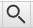

# Hướng dẫn cài đặt Yomichan bằng Tiếng Việt.

Bài viết này mình dịch trực tiếp từ bài viết của TheMoeWay. Đọc bài viết gốc [tại đây](https://learnjapanese.moe/yomichan/). Phần mình dịch chỉ là cài đặt cơ bản của Yomitan và thêm một số nội dung mà mình nghĩ là cần cho mọi người. Các phần khác như là: Tải từ điển Frequency (Độ phổ biến từ), sử dụng Yomitan cho các tệp cục bộ (local files) như tệp HTML chẳng hạn, cài đặt trên Android bạn hãy qua trang của TheMoeWay để tham khảo thêm nha

## Yomitan là gì?
Yomitan là một extension (tiện ích mở rộng) trên trình duyệt (Chrome, Chromium-based hoặc Firefox) cho phép bạn tra cứu các từ tiếng Nhật cả nghĩa lẫn cách đọc trên trang web một cách dễ dàng.

## Bắt đầu
Yomitan có thể tải ở trên cả Chromium và Firefox.

Tải tại đây:

- [Chrome Web Store](https://chromewebstore.google.com/detail/yomitan/likgccmbimhjbgkjambclfkhldnlhbnn) - Cho các trình duyệt như Chrome, Chromium, Brave, Edge hoặc bất kì trình duyệt nào dựa trên nhân Chromium
- [Firefox](https://addons.mozilla.org/en-GB/firefox/addon/yomitan/) - Cho Firefox hay các trình duyệt dựa trên Firefox như Librewolf hoặc Waterfox.

Sau khi cài xong nó sẽ mở một tab mới, bạn đóng trang đó lại và tìm Yomitan trong phần "Tiện ích mở rộng" trong trình duyệt (Hoặc Addons cho Firefox).

## Tải từ điển

Khi bạn mới cài Yomitan lần đầu, bạn sẽ cần cài từ điển để có thể sử dụng nó.

Những tệp này sử dụng phần mở rộng `.zip` (file extension) và **bạn không được giải nén nó ra.**
  
### Từ điển Nhật - Anh

Gợi ý từ người dịch: Bạn nên tải cả bộ Nhật - Anh ở dưới để bao quát lượng từ hơn và có thêm nhiều cái hay nữa.

Bạn có thể tải bộ từ điển từ tác giả gốc của bài viết này: [Bộ sưu tập từ điển Yomitan của Shoui](https://learnjapanese.link/dictionaries)

Từ điển có thể được tìm thấy trong các thư mục tương ứng (Bilingual - Từ điển song ngữ Nhật - Anh, Kanji, Grammar .etc.) 

Bạn nên cài đặt các từ điển sau (theo shoui):

- `Bilingual/[Bilingual] Jitendex (Recommended).zip`  
- `Bilingual/[Bilingual] 新和英.zip`  
- `Kanji/[Kanji] KANJIDIC (English).zip`  
- `Grammar/Dictionary of Japanese Grammar.zip`  
- `Pitch Accent/アクセント辞典v2 (Recommended).zip`

### Từ điển Nhật - Việt:

- [Từ điển Nhật-Việt cho Yomichan](https://github.com/PainterHalver/mazii_to_yomichan/releases/tag/Mazii_Yomichan_Dict) - Được làm bởi [PainterHalver](https://github.com/PainterHalver)
- [KanjiDictVN](https://github.com/trungnt2910/KanjiDictVN/releases/tag/trungnt2910.hannom.20230110-134950.kanjidic2.zip) - Được làm bởi [trungnt2910](https://github.com/trungnt2910)
## Cài đặt từ điển và sử dụng cơ bản
  
1. Bấm vào  icon trên thanh công cụ của trình duyệt.  
2. Bấm vào  icon để mở cài đặt.  
3. Chọn "Dictionaries" ở thanh sidebar bên trái rồi chọn "Configure installed and enabled dictionaries…"  
4. Bấm vào nút "Import" ở bên dưới.  
5. Here's where you select the dictionaries to import. Please only import the following. 

    - `Bilingual/[Bilingual] Jitendex (Recommended).zip`  
    - `Bilingual/[Bilingual] 新和英.zip`  
    - `Kanji/[Kanji] KANJIDIC (English).zip`  
    - `Grammar/Dictionary of Japanese Grammar.zip` 
    - `Pitch Accent/アクセント辞典v2 (Recommended).zip`

6. Đợi các từ điển được thêm vào. Sẽ mất một lúc (Mình làm trên Firefox thấy lâu hơn so với bên Chromium)
7. Sau khi hoàn tất, bạn có thể kiểm tra Yomitan bằng cách giữ phím ++shift++ và di chuột qua văn bản tiếng Nhật. Thử di chuột vào cái này xem: 日本語. Nó sẽ hiện một pop-up box hiển thị các định nghĩa được chia theo từ điển.
 

Bấm ra chỗ khác trên màn hình hoặc phím Esc để ẩn hộp thoại của Yomitan đi

Nếu bạn cần đọc Kanji riêng cho từng từ thì bấm vào Kanji đó (Phải tải KANJIDIC hoặc KanjiDictVN)

Bạn có thể bấm vào nút  để nghe phát âm từ.

Trên thanh công cụ trình duyệt, nếu bạn nhấp vào biểu tượng Yomitan, sau đó nhấp vào biểu tượng  hoặc dùng tổ hợp phím tắt `Alt+ Insert`, bạn có thể truy cập vào "Yomitan Search" - bạn có thể sử dụng Yomitan như một từ điển tiếng Nhật riêng (Hoàn toàn Offline).

